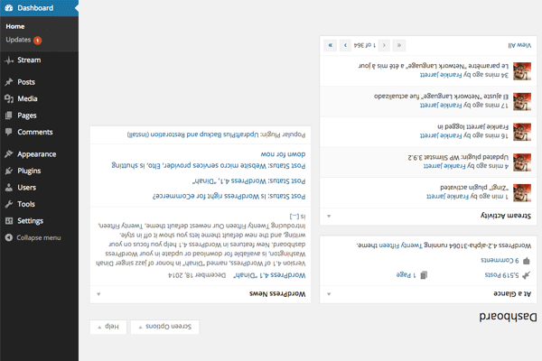
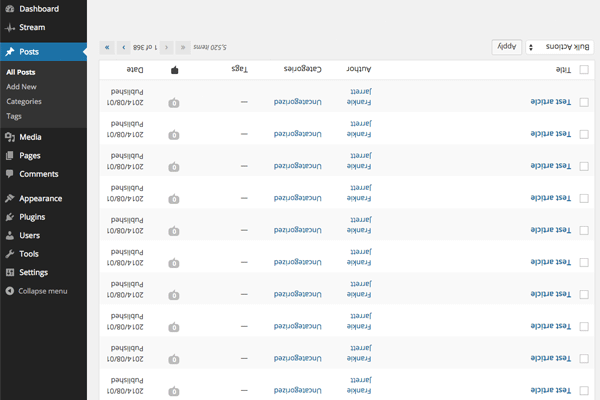
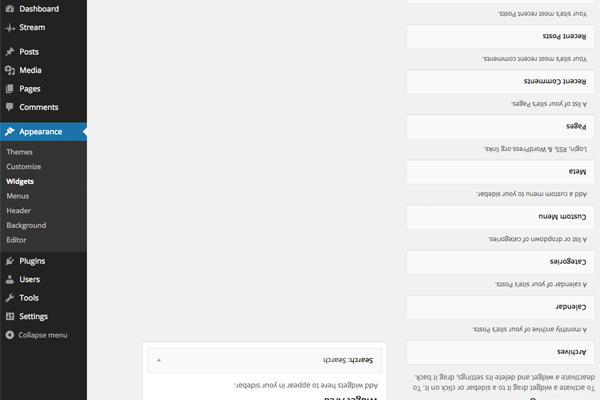
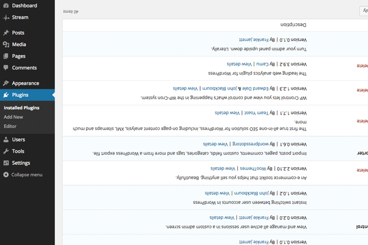

<!-- DO NOT EDIT THIS FILE; it is auto-generated from readme.txt -->
# Zing!

Turn your admin panel upside down. Literally.

**Contributors:** [fjarrett](https://profiles.wordpress.org/fjarrett)  
**Tags:** [admin](https://wordpress.org/plugins/tags/admin)  
**Requires at least:** 2.3  
**Tested up to:** 4.2  
**Stable tag:** trunk (master)  
**License:** [GPLv2 or later](http://www.gnu.org/licenses/gpl-2.0.html)  

 

## Description ##

**Did you find this plugin helpful? Please consider [leaving a 5-star review](https://wordpress.org/support/view/plugin-reviews/zing).**

This plugin is perfect for:

* Playing an [April Fools' Day](http://en.wikipedia.org/wiki/April_Fools%27_Day) joke
* Pissing off your colleagues
* Freaking out your boss
* Increasing hacker bounce rate

Press the `z` key to toggle _Zing!_ on and off.

**Development of this plugin is done [on GitHub](https://github.com/fjarrett/zing). Pull requests welcome. Please see [issues reported](https://github.com/fjarrett/zing/issues) there before going to the plugin forum.**

## Screenshots ##

### Dashboard

### Posts list

### Widgets

### You get the idea

## Changelog ##

### 0.1.0 - January 8, 2015 ###
* Initial release

Props [fjarrett](https://profiles.wordpress.org/fjarrett/)

